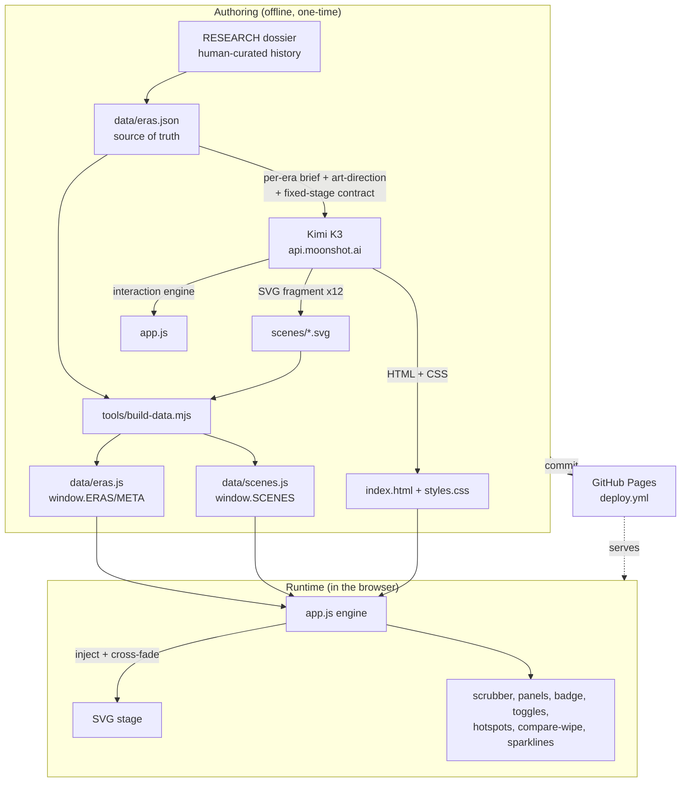

# Architecture — Ozama Timescape

## Overview

Ozama Timescape is a **fully static single-page site**: three files (`index.html`, `styles.css`,
`app.js`) plus two generated data bundles and twelve SVG scenes. There is no backend, no build step
required to run it, and no third-party runtime dependencies — it is vanilla HTML/CSS/JS that a browser
loads directly. Kimi K3 (Moonshot AI) authored the visual scenes and the entire interaction shell; a
human wrote the scaffolding, curated the history, and integrated the pieces.

The one-line idea: a **fixed camera at the mouth of the Ozama River** that morphs across **12
major-change eras (1400 → 2026)** as the user moves through time.

## System diagram

## Components

| Component | Responsibility | Tech |
|---|---|---|
| `data/eras.json` | Human-curated source of truth: 12 eras x (summary, palette, layer cues, hotspots, sourced panels, normalized metrics, citations, confidence) | Hand-authored JSON |
| `scenes/<id>.svg` | Per-era illustrated scene as an inner-SVG fragment (5 parallax layers, theme classes, hotspot + ambient hooks) | **Authored by Kimi K3** |
| `index.html` | Semantic, accessible shell exposing a stable id/hook contract for every feature | **Authored by Kimi K3** |
| `styles.css` | The full cartographic/museum visual design; responsive + `prefers-reduced-motion` | **Authored by Kimi K3** |
| `app.js` | The interaction engine: scrubber, modes, cross-fade + parallax, panels, badge, sources, layer toggles, hotspots, compare-wipe, sparklines, deep links | **Authored by Kimi K3** |
| `tools/kimi/*` | The generation harness (streaming Moonshot client, art-direction contract, per-component scripts) + honest `ITERATION_LOG.md` | Human (Node) |
| `tools/build-data.mjs` | Bundles `eras.json` + scene SVGs into `window.ERAS/META` and `window.SCENES` globals | Human (Node) |
| `tools/verify.mjs`, `render-scene.mjs` | Playwright golden-path verifier + scene QA renders | Human (Node) |
| `.github/workflows/deploy.yml` | Publishes the static root to GitHub Pages on push to `main` | GitHub Actions |

## Data flow

1. **Authoring (offline).** The historical dossier is distilled into `data/eras.json`. For each era,
   the harness sends Kimi K3 that era's brief plus a shared **art-direction contract** and a frozen
   **stage geometry** (viewBox, horizon, river geometry, west-bank SE-tip anchor). Era 1 is generated
   first and then passed to Eras 2-12 as a **style-lock reference**, so twelve independently-generated
   scenes keep the same vantage, scale and rendering style. K3 also authors the shell and `app.js`.
2. **Bundle.** `build-data.mjs` inlines the curated data and the scene SVGs into two plain `<script>`
   globals — no runtime `fetch`, so the site works from `file://` and needs no CORS or JSON loading.
3. **Runtime.** `app.js` reads `window.ERAS` / `window.SCENES`, injects the current era's SVG into one
   of two stacked `<svg>` layers, and **cross-fades** by flipping which layer is in front. The time
   scrubber snaps to the nearest era anchor; changing era updates the HUD, panels, confidence badge,
   sources, sparkline highlight and URL hash. Thematic toggles fade `theme-*` groups; hotspots open
   sourced cards; the compare tool clips a second scene under a draggable divider.

## Deployment

GitHub Pages via `.github/workflows/deploy.yml`. On every push to `main` the workflow assembles the
static files (`index.html`, `styles.css`, `app.js`, `data/`, `scenes/`) into an artifact and deploys
it with `actions/deploy-pages`. No AWS, no server, zero runtime cost. A redeploy is just a push.

## Tech choices & rationale

- **Fully static, no framework.** The experience is a fixed-vantage illustration + a time control; it
  needs no server and no SPA framework. Vanilla JS keeps the payload tiny and the trial honest — the
  frontend code *is* Kimi K3's, not a framework's abstractions.
- **Data-driven from one JSON.** Decoupling history (`eras.json`) from rendering lets K3 regenerate any
  scene or the shell without touching the facts, and keeps every on-screen claim tied to a source and a
  confidence tag.
- **How Kimi K3 was used, specifically.** K3 generated: the 12 scene SVGs (from each era's brief +
  the fixed-stage contract + an Era-1 style reference), the entire `index.html`/`styles.css` shell,
  and the full `app.js` interaction engine. The human did **not** write UI code — the human wrote the
  API client, the art-direction/stage contract, the historical data, the data-bundling and the
  Playwright verification, and did integration + fact-checking. Every prompt, K3 output size, and the
  handful of human fixes are logged in `tools/kimi/ITERATION_LOG.md`. See the README "What this
  showcases" section for the honest verdict on where K3 excelled and where it needed a hand.

## Known limitations / tradeoffs

- **Scene ecology before ~1500 is inference, not survey.** There is no paleoecological core at the
  Ozama mouth; the earliest eras are reconstructed from ecoregion data and colonial descriptions. The
  per-frame **confidence badge** and sources make this explicit rather than hiding it.
- **Sparkline metrics are normalized, illustrative estimates** (0-100), not survey figures — they
  encode documented *direction and rough magnitude* of change only, and are labeled as such.
- **Twelve independently-generated scenes** share a stage contract but are not pixel-identical in
  detail density; some needed a regeneration pass for cross-era consistency (logged).
- **Stylized 2.5D vector, not photoreal or 3D/GIS** — deliberately out of scope to keep it a static,
  legible, fast-loading time machine.
